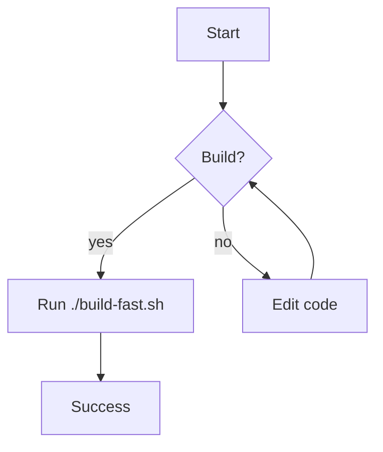

# Markdown Showcase

A quick tour of many common Markdown elements so you can verify rendering.

---

## Headings

# H1
## H2
### H3
#### H4
##### H5
###### H6

---

## Emphasis & Inline

- Plain: text
- Italic: _text_ or *text*
- Bold: __text__ or **text**
- Bold + Italic: **_text_**
- Strikethrough: ~~text~~
- Code: `let answer = 42;`
- Escaping: \*literal asterisks\*, \_underscores\_, \`backticks\`

---

## Blockquotes

> Note: This is a single-level quote.
>
> - It can include lists
> - And `inline code`
>
> > Nested quote level two.
> >
> > - Deep thought here

---

## Lists

- Unordered list item
  - Nested item
    - Third level
- Another item

1. Ordered list item
   1. Nested item
   2. Another nested item
2. Second item

- Mixed list
  1. Ordered inside unordered
  2. Still works

---

## Task Lists

- [x] Render checkboxes
- [ ] Support unchecked state
- [ ] Handle nested tasks
  - [x] Child complete
  - [ ] Child pending

---

## Links

- Inline: [OpenAI](https://openai.com)
- Title: [Rust](https://www.rust-lang.org "Rust language")
- Reference: [Codex CLI][codex] and [CommonMark][cm]

[codex]: https://github.com/openai/codex
[cm]: https://commonmark.org

---

## Images


_Caption: Placeholder banner to test image rendering._

[](https://example.com)

---

## Code Blocks

```rust
// Rust example
fn greet(name: &str) -> String {
    format!("Hello, {}!", name)
}

fn main() {
    println!("{}", greet("Codex"));
}
```

```bash
# Shell example
set -euo pipefail
./build-fast.sh
echo "Build finished."
```

```json
{
  "name": "codex-demo",
  "version": "1.0.0",
  "private": true
}
```

```toml
# Cargo-like TOML
[package]
name = "codex-demo"
version = "0.1.0"
edition = "2021"
```

```diff
diff --git a/hello.txt b/hello.txt
--- a/hello.txt
+++ b/hello.txt
@@
-Hello Wordl
+Hello World
```

---

## Simple Tables

| First Header  | Second Header |
| ------------- | ------------- |
| Content Cell  | Content Cell  |
| Content Cell  | Content Cell  |

| Command | Description |
| --- | --- |
| git status | List all new or modified files |
| git diff | Show file differences that haven't been staged |

## Complex Table

| Name        | Type    | Stars | Notes                  |
|:------------|:--------|------:|:-----------------------|
| codex-core  | library |  4,512| Core execution logic   |
| codex-tui   | app     |  1,203| Terminal UI            |
| codex-web   | app     |    987| Browser front-end      |

Alignment: left, center, right verified above.

| Command | Description |
| --- | --- |
| `git status` | List all *new or modified* files |
| `git diff` | Show file differences that **haven't been** staged |

Contains markdown

---

## Footnotes

Here’s a sentence with a footnote marker.[^1] And another one right here.[^ref]

[^1]: This is the first footnote with more detail.
[^ref]: A second footnote to test multiple references.

---

## Horizontal Rules

---
***
___

---

## Collapsible

<details>
  <summary>Click to expand</summary>

- This content is hidden by default.
- It can include lists and code:

```text
Hidden block content.
```

</details>

---

## Definition List

Term
: The thing being defined.

Another Term
: A second definition with more words for testing.

---

## Callouts (Quote-style)

> [!NOTE]
> This is a helpful note for readers.

> [!TIP]
> Use format!("{value}") to inline variables.

> [!WARNING]
> Treat all warnings as failures during builds.

> [!IMPORTANT]
> Never modify sandbox env var handling in code.

---

## Mermaid (Diagrams)



---

## Mixed Content

- Emoji: ✅ 🚀 💡
- Math (literal text): `E = mc^2`
- Monospace paths: `/usr/local/bin`, `src/main.rs`
- HTML inline: <sup>sup</sup> and <sub>sub</sub>

---

If you want more of any specific element (e.g., longer tables, nested lists, or additional code languages), tell me what to stress-test next.

